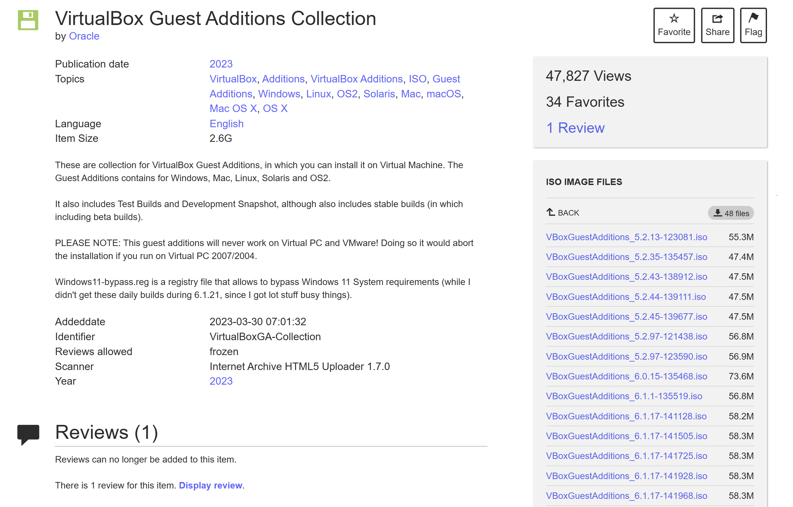

<<<<<<< HEAD
= Rapport SAE 2.03 ISR
:toc: left
:icons: font

== Semaine 1: Installation et Configuration de Debian.
[NOTE]
====
Durant la première semaine de la SAE, l'installation de la machine virtuelle ainsi qu'une grande partie des tâches demandées ont été réalisées sous Windows. Nous avons procédé légèrement différemment, mais nous avons tout de même compris le concept.
====

=== 1.1: Réponses aux questions.
==== *Partie 2.2: Préparation de la Machine Virtuelle*
* *Que signifie “64-bit” dans “Debian 64-bit” ?* +
“64-bit” dans “Debian 64-bit” fait référence à la longueur des registres de données et d’adresses utilisés par le processeur de l'ordinateur. En d’autres termes, un processeur 64 bits peut traiter des données et des instructions en blocs de 64 bits, ce qui lui permet de manipuler des quantités plus importantes d’informations par cycle d’horloge par rapport à un processeur 32 bits.

* *Quelle est la configuration réseau utilisée par défaut ?* +
La configuration réseau utilisée par défaut est le `DHCP` _(Dynamic Host Configuration Protocol)_ qui consiste à un périphérique d'obtenir automatiquement une adresse IP, un masque de sous-réseau, une passerelle et des serveurs DNS depuis un routeur ou un serveur DHCP.footnote:[https://www.debian.org/doc/manuals/debian-reference/ch05.fr.html[Configuration du réseau - Debian]]

* *Quel est le nom du fichier XML contenant la configuration de votre machine ?* +
Le fichier XML contenant la configuration de notre machine est nommé `Debian-SAE203.vbox` et suit généralement le format *[nom de la machine].vbox*.

* *Sauriez-vous le modifier directement ce fichier de configuration pour mettre 2 processeurs à votre machine ?* +
Avec nos connaissances actuelles, et en toute honnêteté, non.

==== *Partie 2.3: Installation de l'OS*
* *Qu’est-ce qu’un fichier iso bootable ?* +
Un fichier ISO bootable est un fichier permettant à un ordinateur de démarrer directement à travers ce fichier afin d'installer un système d'exploitation sur le disque dur d'un ordinateur. En effet, il contient les éléments nécessaires au démarrage d’un ordinateur.

* *Qu’est-ce que MATE ? GNOME ?* +
*MATE* et *GNOME* sont des environnements de bureau _(desktop environment)_ qui sont des logiciels permettant d'utiliser un ordinateur à travers un interface graphique utilisateur _(GUI)_.
** *MATE* est un dérivé de GNOME 2 qui s'appuie sur des concepts traditionnels pour GNU/Linux et d'autres systèmes d'exploitation de type Unix.footnote:[https://mate-desktop.org/fr/[MATE Desktop]] Il a été créé pour offrir une alternative aux utilisateurs qui préféraient l'expérience classique de GNOME 2, après que GNOME soit passé à la version 3 avec une interface plus moderne et différente.
** *GNOME* _(GNU Network Object Model Environment)_ est l'un des environnements de bureau les plus populaires pour Linux et UNIX. En effet, elle est utilisé par défaut dans Red Hat Enterprise Linux, Ubuntu, Debian, Fedora, openSUSE, Vanilla OS, Endless OS, etc.footnote:[https://www.gnome.org/[GNOME]]

* *Qu’est-ce qu’un serveur web ?* +
Un serveur web peut désigner soit un logiciel assurant le service de ressources web (serveur HTTP), soit un ordinateur dédié à répondre aux requêtes du World Wide Web sur un réseau public (Internet) ou privé (intranet), en utilisant principalement le protocole HTTP.footnote:[https://fr.wikipedia.org/wiki/Serveur_web[Serveur Web - Wikipédia]] Selon sa nature, il stocke, traite et distribue les fichiers des sites web aux navigateurs des utilisateurs.

* *Qu’est-ce qu’un serveur ssh ?* +
Le SSH _(Secure Shell)_ désigne à la fois un protocole de communication et un programme informatique. Il permet la connexion d'une machine distante (serveur) via une liaison sécurisée dans le but de transférer des fichiers ou des commandes en toute sécurité.footnote:[https://blogs.oracle.com/oracle-france/post/definition-ssh[Définition SSH - Oracle]]

* *Qu’est-ce qu’un serveur mandataire ?* +
Un serveur mandataire (ou « proxy ») est un logiciel intermédiaire qui s’interpose entre deux hôtes afin de faciliter, contrôler ou sécuriser leurs échanges.footnote:[https://fr.wikipedia.org/wiki/Proxy[Proxy - Wikipédia]]

==== *Partie 3.1: Accès `sudo` pour user*
* *Comment peut-on savoir à quels groupes appartient l’utilisateur user ?* +
On peut connaître les groupes auxquels appartient l'utilisateur `user` grâce à la commande :

[source, bash]
----
groups user
----

==== *Partie 3.2: Installation des Suppléments Invités*
* *Quel est la version du noyau Linux utilisé par votre VM ?* +
La version du noyau Linux _(kernel)_ utilisé par ma VM est `Linux 6.1.0-31-amd64`. On peut le savoir en utilisant la commande:footnote:[https://manpages.debian.org/bookworm/manpages-fr/uname.1.fr.html[UNAME Manuel - Debian]]

[source, bash]
----
uname -r
----

* *À quoi servent les suppléments invités ? Donner 2 principales raisons de les installer.* +
Les suppléments invités apportent de nouvelles fonctionnalités entre la machine hôte et invitéfootnote:[https://www.virtualbox.org/manual/ch04.html#guestadd-intro[Guest Additions - VirtualBox]]:
** *Amélioration de l'intégration de la souris et de l'affichage* entre la machine hôte et invité.
** *Dossiers partagés* entre la machine hôte et invité.

* *À quoi sert la commande mount (dans notre cas de figure et dans le cas général) ?* +
[quote,Karel Zak,MOUNT Manuel - Debian]
Tous les fichiers accessibles par un système UNIX sont insérés dans une grande arborescence, la hiérarchie des fichiers, commençant à la racine « / ». Ces fichiers peuvent être répartis sur différents périphériques. La commande mount permet d'attacher un système de fichiers trouvé sur un périphérique quelconque à la grande arborescence de fichiers.footnote:[https://manpages.debian.org/bookworm/manpages-fr/mount.8.fr.html[MOUNT Manuel - Debian]]

** *Dans notre cas:* la commande `mount` est utilisée pour monter le CD contenant les suppléments invités de VirtualBox, cela permet d’exécuter ensuite l’installation des additions invitées avec :

[source, bash]
----
sudo /mnt/VBoxLinuxAdditions.run
----

** *Dans le cas général:* `mount` sert à attacher des périphériques de stockage (clés USB, disques durs, partitions, fichiers ISO, partages réseau, etc.) au système de fichiers Linux.

==== *Partie 4.2: Quelques Questions*
* *1. Qu’est-ce que le Projet Debian ? D’où vient le nom Debian ?* +
Le "Projet Debian" est une organisation composé de bénévoles et qui a pour but de développer le logiciel libre et promouvoir les idéaux de la communauté du logiciel libre footnote:[https://www.debian.org/releases/stable/amd64/ch01s01.fr.html[Qu'es-ce que Debian?]]. Concernant l'origine du nom Debian, elle est la contraction des noms Debra et Ian Murdock, qui a fondé le projet footnote:[https://www.debian.org/doc/manuals/debian-faq/basic-defs.fr.html#whatisdebian[Comment prononce-t-on Debian et quel est le sens de ce mot ?]].
// La maintenance
* *2. Quelle sont les durées de ces prises en charge ?* +
** La durée minimale est de 3 ans footnote:[https://wiki.debian.org/fr/DebianReleases[DebianReleases]].
** La durée du LTS est de au moins 5 ans footnote:[https://wiki.debian.org/fr/LTS[Debian Long Term Support]].
** La durée du eLTS est de 10 ans footnote:[https://wiki.debian.org/fr/LTS/Extended[Extended Long Term Support]].
* *3. Pendant combien de temps les mises à jour de sécurité seront-elles fournies ?* +
Les mises à jour de sécurité seront fournis pendant 3 ans après sa publication footnote:[https://www.debian.org/security/faq.fr.html#lifespan[Debian LifeSpan FAQ]].
// Nom générique, nom de code et version
* *4. Combien de version au minimum sont activement maintenues par Debian ? Donnez leur nom générique.* +
Debian a toujours, au minimum, 3 versions activement maintenues : "stable", "testing" et "unstable" footnote:[https://www.debian.org/releases/index.fr.html[Debian Version]].
* *5. D’où viennent les noms de code donné aux distributions ?* +
Les noms de code donné aux distributions proviennent des personnages de films "Toy Story" par Pixar footnote:[https://www.debian.org/doc/manuals/debian-faq/ftparchives.fr.html#sourceforcodenames[Source Code Name]]
* *6. Combien et lesquelles sont prises en charge par la version Bullseye ?* +
Le nombre d'architecture prise en charge par la version Bullseye est de 9: "amd64", "i386", "ppc64el", "s390x", "armel", "armhf", "arm64", "mipsel" et "mips64el" footnote:[https://wiki.debian.org/DebianBullseye#Architectures[Debian 11 Architectures]].

====
_La source des questions suivantes est la suivante: https://www.debian.org/doc/manuals/project-history/releases.fr.html[Debian Version]._
====

* 7. Première version avec un nom de code
** *Quelle a était le premier nom de code utilisé ?* +
Le premier nom de code utilisé est Buzz.
** *Quand a-t-il été annoncé ?* +
Elle a été annoncée le 17 juin 1996.
** *Quelle était le numéro de version de cette distribution ?* +
Le numéro de version de cette distribution est le 1.1.
* 8. Dernière nom de code attribué
** *Quel est le dernier nom de code annoncée à ce jour ?* +
Le dernier nom de code annoncé à ce jour est Trixie.
** *Quand a-t-il été annoncé ?* +
Elle a été annoncée en août 2024.
** *Quelle est la version de cette distribution ?* +
Le numéro de version de cette distribution est le 13.

<<<

=== 1.2: Installation Debian Préconfigurée

[NOTE]
====
Concernant le rapport de nos actions sur la *partie 2 à 4*, nous n’avons pas jugé pertinent de le détailler, car nous nous sommes simplement conformés aux exigences demandées.
====

==== *Partie 5.1: Récupérer et préparer les fichiers nécessaires : [red]#Rapport#*
L'automatisation de l'installation d'un système d'exploitation comme Debian simplifie et optimise le déploiement, tout en réduisant les risques d'erreurs humaines. De plus, cela permet de se détendre et de jouer à Minecraft pendant que l'installation se fait, sans avoir à intervenir.

Cette section présente les étapes et les choix techniques qui ont permis de mettre en place un processus d'installation automatisée pour Debian sur Windows. 

Pour des raisons qui me sont encore sombre, l'application VirtualBox de ma session dans les salles de TP refuse obstinément de s'ouvrir.

*Tristesse et désespoir.*

Après avoir créé la machine virtuelle sur VirtualBox dans un répertoire facilement accessible et où OneDrive ne viendrait pas me ralentir, c'est-à-dire dans le dossier *"Downloads"*, j'ai téléchargé l'archive `autoinstall_Debian.zip` depuis Moodle et l'ai décompressée dans le répertoire de ma machine virtuelle : `< .\Downloads\SAE-203\Debian-SAE203 >`.

Comme demandé, je suis allé dans WSL et j'ai utilisé la commande suivante :

[source, bash]
----
cd /mnt/c/Users/ridhi/Downloads/SAE-203/Debian-SAE203/autoinstall_iut_salles_TP && sed -i -E "s/(--iprt-iso-maker-file-marker-bourne-sh).*$/\1=$(cat /proc/sys/kernel/random/uuid)/" S203-Debian12.viso
----

Cela m'a permis de me déplacer dans le répertoire où se trouvait le fichier *S203-Debian12.viso* et de remplacer la chaîne "@@UUID@@" par un identifiant unique universel. 

J'ai ensuite vérifié que tout était OK en ouvrant le fichier et, effectivement, le "@@UUID@@" avait bien été remplacé par une série de lettres et de chiffres.

J'ai ensuite inséré le fichier *S203_Debian12.viso* dans le lecteur optique de ma machine virtuelle et lancé celle-ci. Et là, c'est le drame : *LES PROBLÈMES COMMENCENT !*

VirtualBox m'affiche une erreur comme quoi il ne trouve pas le fichier *debian[...].iso* :

.Erreur : Le fichier .iso à exécuter n'a pas été trouvé.[[Figure_1]]

Heureusement, j'avais pris soin de vérifier le fichier *S203-Debian12.viso*, où j'avais remarqué le chemin indiqué dans la link:#Figure_1[Figure 1], mais auquel je n'avais pas prêté attention:

image::./img/probleme-1.png[]

J'ai donc téléchargé le fichier *debian[...].iso* depuis leur https://www.debian.org/[site officiel] et je l'ai placé dans le répertoire `< .\Downloads\SAE-203\Debian-SAE203\autoinstall_iut_salles_TP\ressources >`. 

J'ai ensuite modifié le fichier *S203-Debian12.viso* pour y insérer un chemin absolu vers ce fichier *debian[...].iso* en écrivant :
====
C:\Users\ridhi\Downloads\SAE-203\Debian-SAE203\autoinstall_iut_salles_TP\S203-Debian12.viso
====
Et ça n'a pas marché. 

Du coup, j'ai changé de stratégie, passé en mode Linux _(en écrivant "mon/chemin" au lieu de "mon\chemin")_ et utilisé un chemin relatif, comme le montre l'image ci-dessous.

image::./img/solution-1.png[]

J'ai redémarré la machine, mais une nouvelle erreur est apparue, différente de la précédente.

.Erreur : Le  VBoxGuestAdditions.iso à exécuter n'a pas été trouvé.[[Figure_2]]

Je suis donc allé chercher sur Internet le fichier *VBoxGuestAdditions.iso*. Je l'ai trouvé sur le site suivant : https://archive.org/details/VirtualBoxGA-Collection[VirtualBox Guest Additions Collection : Oracle : Free Download, Borrow, and Streaming : Internet Archive]. 

J'y ai téléchargé la dernière version, modifié son nom et l'ai placé dans le répertoire où se trouvait le fichier *debian[...].iso*, c'est-à-dire dans `< .\Downloads\SAE-203\Debian-SAE203\autoinstall_iut_salles_TP\ressources >``. 

Ensuite, j'ai encore modifié le fichier *S203-Debian12.viso*:

.Fichier S203-Debian12.viso avant

.Fichier S203-Debian12.viso après

Enfin, tout semblait fonctionner, et la machine a commencé son installation… jusqu'à ce qu'une nouvelle erreur apparaisse.

.Erreur: Proxy[[Figure_5]]
image::./img/erreur-proxy.png[]

Je me suis souvenu de ce que M. Carle avait mentionné dans son PDF, affiché sur mon autre écran, concernant le fichier *preseed.cfg* :

[quote, Mr. Carle, sae203-1.pdf]
"Pour un usage autre (chez vous ou avec une autre version de Debian), il faudra adapter ce fichier de pré-configuration (par exemple, commenter la ligne définissant le proxy)".

J'ai donc commenté la section concernant le proxy:

[NOTE]
====
En recréant la VM pour prendre des captures d'écran pour ce rapport, j'ai remarqué que le Wi-Fi que j'utilisais jouait un rôle par rapport au proxy. 

En clair : quand je suis connecté à *eduroam*, tout fonctionne, mais dès que je suis sur le Wi-Fi de ma résidence, ça plante (ce n'est pas comme si c'était écrit en gros sur la link:#Figure_5[Figure 5], mais bon…).
====

Enfin, tout est devenu fonctionnel et l'installation s'est parfaitement déroulée.

<<< 

==== *Partie 5.1: Récupérer et préparer les fichiers nécessaires : [red]#Question#*
Cette section détaillera tous les ajouts et modifications que j’ai apportés au fichier `preseed-fr.cfg` afin de répondre aux exigences demandées.

* *Ajouter le droit d’utiliser sudo à l’utilisateur standard* +
En me basant sur le guide de préconfiguration Debian concernant la *https://www.debian.org/releases/stable/amd64/apbs04.fr.html#preseed-account[configuration des comptes]*, j’ai modifié le groupe *sudo* dans `d-i passwd/user-default-groups`:

[source, ini]
----
## Utilisateur standard (~ ligne 50)
[...]
d-i passwd/user-default-groups string audio cdrom video sudo
----

* *Installer l’environnement MATE.* +
En me basant sur le guide de préconfiguration Debian concernant le *https://www.debian.org/releases/stable/amd64/apbs04.fr.html#preseed-pkgsel[choix des paquets]*, j’ai modifié *mate-desktop* dans `tasksel tasksel/first`:

[source, ini]
----
## Installation meta-paquetages (~ ligne 82)
[...]
tasksel tasksel/first multiselect standard, ssh-server, mate-desktop
----

* *Ajouter les paquets suivants : sudo, git, sqlite3, curl, bash-completion, neofetch*
En me basant sur le guide de préconfiguration Debian concernant le *https://www.debian.org/releases/stable/amd64/apbs04.fr.html#preseed-pkgsel[choix des paquets]*, j’ai ajouté les lignes suivants:

[source, ini]
----
# Paquets supplémentaires (~ ligne 67)
d-i pkgsel/include string sudo git sqlite3 curl bash-completion neofetch
----

<<<

=== 1.3: Procédure pour l'Auto-Installation de Debian
Cette section vous guidera dans l'installation automatique de Debian sur Windows, ainsi que sur Linux et d'autres systèmes.

==== *Prérequis* 
====
. *VirtualBox:* Assurez-vous que VirtualBox est bien installé et fonctionnel avec son «extension pack» sur la machine hôte. Si ce n'est pas le cas, vous pouvez le télécharger et l'installer depuis le site officiel : https://www.virtualbox.org/[VirtualBox].
. *L'archive contenant les fichiers nécessaires à l’installation d’une Debian sur l’application VirtualBox link:./src/debian.zip[ici].*
. *Une image ISO de Debian https://www.debian.org/[disponible ici].*
. *Une image ISO VBoxGuestAdditions:* Cette image contient les VirtualBox Guest Additions, qui sont un ensemble de pilotes et d'outils destinés à améliorer les performances et l'intégration du système d'exploitation invité (OS dans une machine virtuelle) avec l'hôte (le système d'exploitation de la machine physique). Vous pouvez le télécharger en cliquant https://archive.org/details/VirtualBoxGA-Collection[ici].
. *Un éditeur de texte pour pouvoir modifier le fichier `preseed-fr.cfg` et `S203-Debian12.viso`.*
. *Assurez-vous d'avoir au moins 25 Go d'espace libre sur votre disque dur.*
. *Vous devez avoir au minimum 4 Go de RAM.*
====

==== *Création de la machine virtuel*
====
* Démarrez VirtualBox et créez une nouvelle machine virtuelle en cliquant sur "Nouvelle".
* Dans la section *Name and Operating System*:

[cols="2,2"]
|===
| *Label* | *Input* 
| Nom | Entrez le nom de la machine (un nom significatif ou symbolique). 
| Folder | Choisissez le répertoire où votre machine virtuelle sera enregistrée et stockée. 
| ISO Image | Rien.
| Edition | Rien.
| Type | Linux
| Subtype | Debian
| Version | Debian 64-bit ou Debian 12 Bookworm
|===

* Dans la section *Hardware*:
[cols="2,2"]
|===
| *Label* | *Input* 
| Mémoire vive | 2048MB
| Processors | 1
| Enable EFI | ☐
|===

* Dans la section *Hard Disk*:
[cols="2,2"]
|===
| *Label* | *Input* 
| Create a Virtual Hark Disk now | Cocher ⦿
| Hard Disk File Location and Size | Dans le même répertoire que celui mentionné précédemment _(Folder)_, 20 Go d'espace disque suffisent.
| Hard Disk File Type and Variant | Pas besoin.
|===

* Cliquez sur "Finish".
====

==== *Préparation des fichiers nécessaire pour l'installation*
====
* Récupérez l'archive contenant les fichiers nécessaires à l’installation de Debian link:./src/debian.zip[ici] et décompressez-la dans le répertoire où vous avez créé votre machine virtuelle précédemment.
* Téléchargez l'image https://www.debian.org/[ISO de Debian] ainsi que https://archive.org/details/VirtualBoxGA-Collection[VirtualBox Guest Additions].
* Une fois les fichiers .iso téléchargée, placez le fichier dans le répertoire *ressource* qui se trouve à l'intérieur de l'archive que vous avez décompressé précédemment.
* Ouvrez votre Terminal et entrez la commande suivant:

[source, bash]
----
cat /proc/sys/kernel/random/uuid
----

* Copiez le résultat de la commande, puis ouvrez le fichier `S203-Debian12.viso`, qui se trouve dans l’archive décompressée. Remplacez la chaîne `@@UUID@@` par le résultat de la commande en collant ce que vous avez copié.
* Toujours dans le fichier `S203-Debian12.viso`, remplacez la chaîne située à la troisième ligne `{votre fichier debian[...].iso}` par le nom du fichier Debian ISO que vous avez téléchargé. 
* Ensuite, à la fin du fichier, remplacez `{votre fichier VBGA.iso}` par le nom de votre fichier *VirtualBox Guest Additions*, qui se trouve dans le répertoire *ressources*. _(Assurez-vous d'ajouter l'extension `.iso` si elle n'apparaît pas lorsque vous collez le nom du fichier.)_
* Enfin, si nécessaire, et en vous basant sur le https://www.debian.org/releases/stable/amd64/apbs04.fr.html[contenu du fichier de préconfiguration pour Bookworm], vous pouvez modifier le fichier `preseed-fr.cfg`.

====

==== *Installation Automatique de la machine virtuelle*
====
Nous arrivons à la fin de la procédure pour l'auto-installation de Debian.  

. Retournez sur VirtualBox.  
. Sélectionnez la machine virtuelle que vous avez créée.  
. Cliquez sur *Configuration*.  
. Allez dans l'onglet *Stockage*.  
. Sélectionnez *Contrôleur: IDE*, puis cliquez sur l'icône de disque avec un "+".  
. Cliquez sur *Ajouter*, puis recherchez et sélectionnez `S203-Debian12.viso` dans votre répertoire.  
. Cliquez sur *Choose*, puis supprimez le disque vide en faisant un clic droit dessus et en sélectionnant *Supprimer*.  
. Cliquez sur *OK*, puis démarrez votre machine. L'installation automatique débutera.  
. Une fois l'installation terminée, voici les identifiants de votre machine :
[cols="2,2"]
|===
| *Nom Utilisateur* | *Mot de passe* 
| root | root
| user | user
|===

====

<<<

== Semaine 2: Apprentissage Balisage Léger - Base

<<<

== Semaine 3: Recherche et étude des applications clientes.
=== 3.1: Réponses aux questions.
==== *Partie 1.2: Les interfaces graphiques pour git*
* *Qu’est-ce que le logiciel gitk ? Comment se lance-t-il ?* +
`gitk` est un logiciel qui affiche l'historique des *commits* d'un dépôt Git. Il affiche les branches, les tags, et les modifications dans une vue arborescentefootnote:[https://git-scm.com/docs/gitk[Git - gitk Documentation]]. Il se lance en exécutant la commande suivante dans un terminal, depuis le répertoire d’un dépôt Git :

[source, bash]
----
gitk
----

* *Qu’est-ce que le logiciel git-gui ? Comment se lance-t-il ?* +
`git-gui` est une interface graphique permettant de préparer des commits, gérer les index, faire des push, pull et mergefootnote:[https://git-scm.com/docs/git-gui[Git - git-gui Documentation]]. Il se lance en exécutant la commande suivante dans un terminal, toujours dans le répertoire d’un dépôt Git :

[source, bash]
----
git gui
----

==== *Partie 1.3: Installons autre chose et comparons*
* *Pourquoi avez-vous choisi ce logiciel ?* +
https://git-cola.github.io/[*Git Cola*] est un bon choix, car il est léger, open source, propose une interface claire pour gérer les dépôts Git et me rend nostalgique du _Coca Cola_.

* *Comment l’avez vous installé ?* +
Je l’ai installé en suivant les instructions de la page de téléchargement de https://git-cola.github.io/downloads.html[Git Cola] puis en exécutant la commande suivante :

[source, bash]
----
sudo apt install git-cola
----

* *Comparer-le aux outils inclus avec git ainsi qu’avec ce qui serait fait en ligne de commande pure : fonctionnalités avantages, inconvénients…*
** *Gitk* :
*** Avantages : Simple, rapide, montre un bon historique visuel.
*** Inconvénients : Interface un peu vieillotte, manque de fonctionnalités avancées.

** *Git-Gui* :
*** Avantages : Bonne gestion des index, possibilité de commit visuellement.
*** Inconvénients : Interface minimaliste, pas très intuitive pour les débutants.

** *Git-Cola* :
*** Avantages : Interface moderne, nombreuses fonctionnalités, personnalisable.
*** Inconvénients : Peut être plus lourd ou complexe à prendre en main.

** *Ligne de commande Git* :
*** Avantages : Puissante, flexible, tout est accessible via des commandes.
*** Inconvénients : Courbe d’apprentissage plus élevée, nécessite de mémoriser des commandes.

=== 3.2: Rapport sur nos actions réalisées durant cette semaine.
==== *Configuration Globale de Git*
J’ai commencé par ouvrir ma machine virtuelle et utiliser le raccourci clavier *Ctrl+Alt+T* pour ouvrir le Terminal.

J’ai ensuite suivi les étapes demandées en définissant le nom d’utilisateur global pour Git :

[source, bash]
----
git config --global user.name "El-Khair Nourdine"
----

Puis, j’ai défini l’adresse e-mail globale associée aux commits :

[source, bash]
----
git config --global user.email "el-khair.nourdine.etu@univ-lille.fr"
----

Enfin, j’ai défini le nom de la branche par défaut lors de l’initialisation d’un nouveau dépôt :

[source, bash]
----
git config --global init.defaultBranch "master"
----

==== *Les Interfaces Graphiques pour Git: Initialisation*
J’ai commencé à mettre à jour la liste des paquets disponibles en exécutant la commande :

[source, bash]
----
sudo apt update && sudo apt upgrade
----

Ensuite, j’ai installé les paquets `gitk` et `git-gui` :

[source, bash]
----
sudo apt install gitk && sudo apt install git-gui
----

Avant de les utiliser, j’ai pris le temps de me renseigner sur leur fonctionnement en consultant les sites suivantes :

* https://codeur-pro.fr/git-gui-guide-complet/[Guide Git Gui]
* https://codeur-pro.fr/gerer-son-historique-visuellement-avec-gitk/[Guide Gitk]

Après avoir compris leur fonctionnement, j’ai transféré l’archive de ce rapport sur le bureau de ma machine virtuelle. J’ai ensuite créé un répertoire sur mon bureau pour y placer mon rapport et commencer à manipuler `gitk` et `git-gui` :

[source, bash]
----
mkdir ~/Bureau/git-test && cd ~/Bureau/git-test && mv ../rapport .
----

==== *Les Interfaces Graphiques pour Git: Git Gui*

J’ai voulu tester *gitk* en exécutant la commande `gitk &` dans le répertoire _git-test_, mais j’ai rencontré un link:#erreur.gitk[message d’erreur] indiquant que Git ne parvenait pas à interpréter correctement l’argument *HEAD*. 

.Message d'erreur gitk[[erreur.gitk]]

Ce problème venait du fait que je n’avais pas encore initialisé de dépôt Git. J’ai donc commencé par utiliser *git-gui*, en exécutant la commande `git gui &` pour initialiser un dépôt Git avant tester *gitk*.

À l’ouverture, l’interface de Git Gui se présente ainsi : 

J’ai ensuite créé un nouveau dépôt, ce qui équivaut à la commande `git init`. 

Puis, j’ai cliqué sur *Naviguer* et étant donné que j’avais exécuté la commande `git gui &` dans le répertoire contenant mon rapport, je n’ai pas eu à faire beaucoup de manipulations. J’ai simplement cliqué sur OK : 

image::img/gg-navigation.png[]

Pour faire un premier essai, j’ai indexé le fichier _rapport.adoc_ en cliquant sur l’icône à gauche de son nom. Dans le champ *Message de commit initial*, j’ai saisi : "rapport initial".

J’ai ensuite cliqué sur *Signer*, puis sur *Committer*, ce qui équivaut à la commande : `git commit -m "rapport initial"`

J’ai ensuite modifié le fichier _rapport.adoc_ en exécutant la commande suivante dans le terminal :

[source, bash]
----
pluma rapport-intermediaire/rapport.adoc
----

J’ai supprimé une partie du contenu, puis enregistré le fichier.

En revenant dans Git Gui, j’ai cliqué sur *Recharger modifs* pour voir apparaître le _rapport.adoc_ qui n’était plus visible à cause du commit précédent. 

Ensuite, j’ai cliqué sur l’icône à gauche de son nom pour l’indexer, visualiser les modifications et les committer:

J’ai ensuite remis _rapport.adoc_ à son état initial, puis cliqué sur *Recharger modifs* avant de cliquer sur *Indexer modifs* pour ajouter toutes les fichiers à l’index. Enfin, j’ai validé en commitant : 

image::img/index-all.png[]

Maintenant, je vais voir ce que donne *Gitk*.

==== *Les Interfaces Graphiques pour Git: Gitk*
J’ai exécuté la commande `gitk &` pour ouvrir Gitk en arrière-plan dans le répertoire de mon rapport.

image::img/gitk.png[]

Ensuite, j’ai pu visualiser l’ensemble des commits présents dans mon dépôt en lisant les messages des commits, l’auteur, ainsi que la date de création de chaque commit.

J’ai ensuite exploré l’historique en comparant les différences entre les commits, en observant l'ancienne version et la nouvelle version des fichiers. 

==== *Installons Autre Chose: Git Cola*

== Semaine 4: Gitea : Installation & Utilisation du Service
=== 4.1: Réponses aux questions.
==== *Partie 2.0: Installation de Gitea*
* *Qu’est-ce que Gitea ?* +
Gitea est une plateforme auto-hébergée de gestion de dépôts Git. Elle permet l'hébergement de code, la revue de modifications et la collaboration entre développeurs, un registre de paquets et des fonctionnalités CI/CD.footnote:[https://about.gitea.com/products/gitea/[Gitea Official Website]]
* *À quels logiciels bien connus dans ce domaine peut-on le comparer ?* +
Les logiciels bien connus dans ce domaine sont *GitHub* et *GitLab*.

==== *2.1.2. Mise à jour du binaire du service Gitea*
* *Quelle version du binaire avez-vous installé ? Donnez la version et la commande permettant d’obtenir cette information.* +

* *Comment faire pour mettre à jour le binaire de votre service sans devoir tout reconfigurer ? Essayez en mettant à jour vers la version 1.22-dev.* +

=== 4.2: Rapport sur nos actions réalisées durant cette semaine.
=======
= Rapport SAE 2.03 ISR
:toc: left
:icons: font
:lang: fr
:encoding: utf-8
:doctype: article
:figure-caption!:
:pdf-fontsdir: font
:pdf-themesdir: theme
:toc-title: Table des matières

[abstract]
.Résumé

Ce rapport documente les différentes étapes et apprentissages réalisés dans le cadre de la SAE 2.03 ISR. Il est structuré en plusieurs semaines de travail, chacune abordant un aspect spécifique de l'installation, de la configuration et de l'utilisation de divers outils informatiques.

<<<

== Semaine 1: Installation et Configuration de Debian.

[NOTE]
====
Durant la première semaine de la SAE, l'installation de la machine virtuelle ainsi qu'une grande partie des tâches demandées ont été réalisées sous Windows. Nous avons procédé légèrement différemment, mais nous avons tout de même compris le concept.
====

=== 1.1: Réponses aux questions.
include::src/semaine 1/questions.adoc[]

=== 1.2: Rapport sur nos actions réalisées durant cette semaine.

[NOTE]
====
Concernant le rapport de nos actions sur la *partie 2 à 4*, nous n’avons pas jugé pertinent de le détailler, car nous nous sommes simplement conformés aux exigences demandées.
====

include::src/semaine 1/rapport.adoc[]

=== 1.3: Procédure pour l'Auto-Installation de Debian
Cette section vous guidera dans l'installation automatique de Debian sur Windows, ainsi que sur Linux et d'autres systèmes _(où vous devez adapter la méthode)_.

include::src/semaine 1/procedure.adoc[]

<<<

== Semaine 2: Apprentissage Balisage Léger - Base

<<<

== Semaine 3: Recherche et étude des applications clientes.
=== 3.1: Réponses aux questions.

include::src/semaine 3/questions.adoc[]

=== 3.2: Rapport sur nos actions réalisées durant cette semaine.

include::src/semaine 3/rapport.adoc[]

<<<

== Semaine 4: Gitea : Installation & Utilisation du Service
=== 4.1: Réponses aux questions.

include::src/semaine 4/questions.adoc[]

=== 4.2: Rapport sur nos actions réalisées durant cette semaine.

[NOTE]
====
Le rapport sera structuré en deux parties : 

* *link:#installation_gitea[L'installation de Gitea]* où je décris le processus d'installation de Gitea, les erreurs rencontrées et les solutions que j'ai appliquées pour les corriger.

* *link:#utilisation_gitea[L'utilisation de Gitea]* où j'explique mon utilisation de Gitea.
====

include::src/semaine 4/rapport-installation.adoc[]

include::src/semaine 4/rapport-utilisation.adoc[]

=== 4.3: Procédure pour l'installation de Gitea

[NOTE]
====
Cette section vous guidera à travers les étapes nécessaires pour installer *Gitea version 1.23.5* et le configurer en tant que service sur une machine Linux.
====

include::src/semaine 4/procedure.adoc[]
>>>>>>> 4ac2910 (rapport-final)
